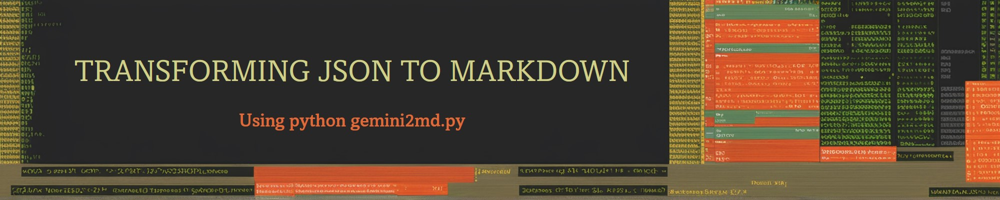
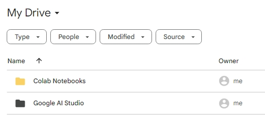
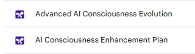
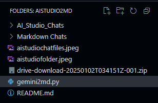

# 🚀 Gemini To Markdown Converter

## 🌟 Overview

Transform your Google AI Studio chats into beautifully formatted Markdown documents with ease!

## 📋 Steps

1. **Navigate to Your Google Drive Folder**:
   - 

2. **Download Your AI Studio Files**:
   - Select multiple files to download as a Zip file. Remember, these files are in JSON format but lack a file extension. Add `.json` to the end of each file name.
   - 

3. **Run the Script**:
   - Place your zip file in the same directory as this repo and execute the script.
   - Your file browser should look like this:
   - 

## 🛠️ What the Script Does

The script will:
- 🗂️ Unzip the file
- 📁 Create a new folder called "AI_Studio_Chats"
- 📦 Move all the files into the new folder
- ✏️ Rename the files to have a `.json` extension
- 📁 Create a new folder called "Markdown Chats"
- 🔄 Convert the JSON files to Markdown files and place them in the "Markdown Chats" folder

## 🚀 Usage

1. **Clone the Repository**:
   ```sh
   git clone <repository-url>
   cd <repository-directory>
   ```

2. **Place Your Zip File**:
   - Ensure your downloaded zip file is in the same directory as the script.

3. **Run the Script**:
   ```sh
   python gemini2md.py
   ```

4. **Check the Output**:
   - Find your converted Markdown files in the "Markdown Chats" folder.

## 💡 Example

Here's a quick example of running the script:

```sh
$ python gemini2md.py
Unzipping complete and .json extension added to files.
Successfully converted 'AI_Studio_Chats/example.json' to 'Markdown Chats/example.md'
```

## 🛠️ Troubleshooting

- Ensure the zip file is in the correct directory.
- Verify that the JSON files are properly formatted.
- Check the console output for error details if you encounter any issues.

## 📜 License

This project is licensed under the MIT License.
